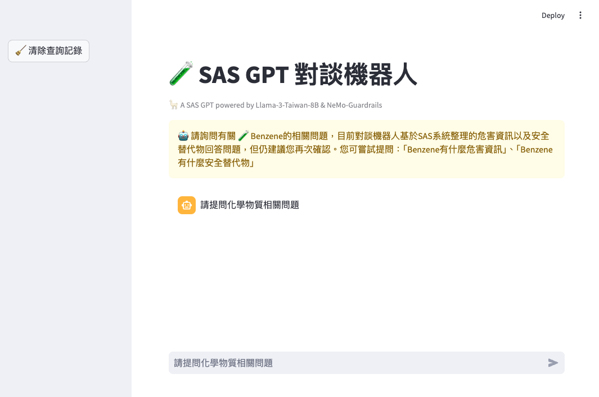
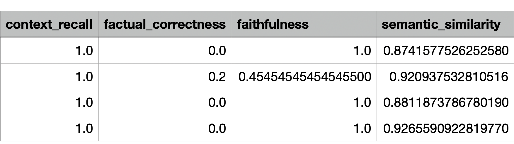

# ADL_FINAL

Chemical Informatics and Alternative Substance Chatbot Service



## Environment Setup

### 0. Install Ollama

First, download and install the appropriate version of Ollama from the official website: [Ollama Official Website](https://ollama.com).

After installation, launch Ollama and ensure that the model runs locally:

```bash
ollama run kenneth85/llama-3-taiwan
```

### 1. Create a Conda Environment

```bash
conda create -n FINAL python=3.11
```

### 2. Activate the Conda Environment

```bash
conda activate FINAL
```

### 3. Install Required Packages

```bash
pip install -r requirements.txt
```

## Execute RAG

### Launch Command
Click the URL displayed in the output to start using the chatbot service:

```bash
streamlit run chatbot.py --server.port xxxx
```

### Example

```bash
streamlit run chatbot.py --server.port 2024
```

## Data Processing

Convert chemical substance data in a `.txt` file into a vector database. Configure the file path, chunk size, and overlap size, and use Chroma to save it as a vector database:

```bash
python txt_to_vector.py
```

## Model Loading

Set up the LLM and Embedding models. Choose the appropriate models based on your needs:

```bash
python init_model.py
```

## Prompt and Chatbot Usage Rules Configuration

- **Modify RAG Character Prompt Content**: Adjust `retriever_chain.py`.
- **Modify Nemoguardrails Constraints**: Edit `./config/config.yml`.


## Evalutation
We store the chatbot's responses to our various questions in a JSON file and split them into smaller parts to avoid OpenAI API timeouts. We then execute `evaluation.py` on each part to evaluate our RAG model. Finally, we compile the results into a chart and include it in the report.

```bash
python evaluation/evaluation.py
```

The following are the four indicators that will be generated after the RAGAS assessment:

